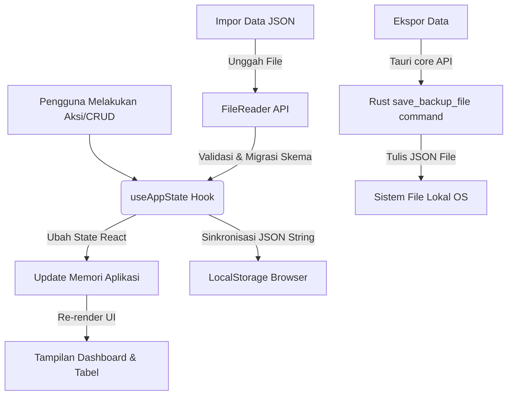

# Dokumentasi Lengkap Proyek Asrep (Analytics Report Tracker)

Dokumentasi ini memberikan panduan mendalam tentang arsitektur, struktur kode, aliran data, dan pedoman pengembangan untuk aplikasi **Asrep**.

---

## 1. Ikhtisar & Arsitektur Aplikasi

**Asrep** adalah aplikasi desktop cross-platform yang dirancang untuk melacak, mengelola, dan menganalisis performa konten media sosial secara dinamis pada platform **Instagram** dan **TikTok**.

### Arsitektur Utama
Aplikasi ini dibangun menggunakan arsitektur modern **hybrid desktop**:
- **Backend (Rust - Tauri)**: Bertindak sebagai wrapper desktop native, mengelola integrasi OS (seperti dialog penyimpanan file backup native) dan menyediakan performa tinggi dengan konsumsi memori yang sangat efisien.
- **Frontend (React + TypeScript)**: Mengelola UI, rendering state, visualisasi grafik, dan formulir interaktif.
- **Penyimpanan Lokal (LocalStorage)**: Seluruh data aplikasi disinkronkan secara otomatis dan disimpan di LocalStorage pengguna, menghilangkan ketergantungan pada database eksternal dan memungkinkan aplikasi berjalan 100% offline.

---

## 2. Struktur Folder & Detail File

Berikut adalah peta struktur berkas proyek beserta fungsionalitas detail dari masing-masing komponen:

```text
Asrep/
├── DESIGN.md                 # Spesifikasi token desain (Meta-design-analysis)
├── UIUX_DOCUMENTATION.md     # Panduan token, prinsip, spasi, & aksesibilitas UI/UX
├── README.md                 # Panduan dasar proyek (Material Design 3 setup)
├── package.json              # Dependensi proyek & npx/npm scripts
├── postcss.config.js         # Konfigurasi preprosesor PostCSS
├── tailwind.config.js        # Konfigurasi lama Tailwind (untuk referensi CSS)
├── tsconfig.json             # Konfigurasi kompilasi TypeScript
├── vite.config.ts            # Konfigurasi bundler Vite untuk React & Tauri
├── patch_dashboard.cjs       # Script utilitas untuk patching otomatis DashboardView
├── src/                      # Source code utama Frontend
│   ├── App.tsx               # Entry point utama aplikasi, routing view, modal konfirmasi, & toasts
│   ├── index.css             # Konfigurasi tema global, variabel CSS, & animasi kustom
│   ├── types.ts              # Definisi tipe data & antarmuka (interface) TypeScript
│   ├── main.tsx              # Bootstrap aplikasi React
│   ├── vite-env.d.ts         # Deklarasi tipe lingkungan bundler Vite
│   ├── components/           # Komponen antarmuka pengguna (UI Components)
│   │   ├── MacSidebar.tsx    # Panel navigasi kiri (Platform, folder tahun/bulan, profil, backup)
│   │   ├── DashboardView.tsx # Tampilan dashboard performa (Statistik, grafik Recharts, kalender)
│   │   ├── MonthFolderView.tsx # Tampilan folder bulanan (Tabel konten, pengelompokan, & pencarian)
│   │   ├── ContentPopup.tsx  # Modal form tambah/edit entri konten harian
│   │   └── MacDropdown.tsx   # Komponen dropdown kustom (aman dari click-block Safari/WebKit)
│   ├── hooks/
│   │   └── useAppState.ts    # Custom React Hook untuk manajemen state global & fungsi I/O data
│   └── utils/
│       └── initialState.ts   # Data inisiasi (mock data April-Mei 2026) & helper tanggal
└── src-tauri/                # Konfigurasi & Source Code backend Rust
    ├── Cargo.toml            # Dependensi Rust (crate metadata)
    ├── tauri.conf.json       # Konfigurasi konfigurasi window, izin, & bundler Tauri
    └── src/
        └── main.rs           # Entry point backend Rust & registrasi Tauri Command
```

### Detail Fungsionalitas File Frontend:

1. **[App.tsx](file:///Users/Bonnxxv/Documents/Projek%20App%20Bonnxxv/Asrep/src/App.tsx)**:
   - Bertindak sebagai pengatur rute utama (routing) tampilan antara `DashboardView` dan `MonthFolderView`.
   - Menginisialisasi preferensi tema (Light/Dark) dari LocalStorage dan menyinkronkan class `.dark` pada dokumen.
   - Menampung komponen popup global seperti modal konfirmasi hapus data dan banner toast notifikasi status sistem.

2. **[useAppState.ts](file:///Users/Bonnxxv/Documents/Projek%20App%20Bonnxxv/Asrep/src/hooks/useAppState.ts)**:
   - Hook utama yang menyuplai fungsi-fungsi CRUD (Create, Read, Update, Delete) data konten, tahun, dan profil.
   - Menyediakan logika migrasi data otomatis (`migrateFoldersData` & `migrateProfilesData`) ketika mendeteksi data cadangan lama untuk dicocokkan ke skema baru.
   - Menghubungkan fungsi ekspor JSON dengan API native Tauri `save_backup_file` dan menyediakan fallback unduhan browser jika berjalan di luar webview Tauri.

3. **[DashboardView.tsx](file:///Users/Bonnxxv/Documents/Projek%20App%20Bonnxxv/Asrep/src/components/DashboardView.tsx)**:
   - Menyajikan ringkasan metrik performa dalam tab Bulanan & Tahunan.
   - Menggunakan pustaka `recharts` untuk menggambar grafik tren performa tayangan konten:
     - **Combined Trend**: Tren gabungan Instagram & TikTok dalam grafik garis tunggal.
     - **Daily Trend**: Fluktuasi tayangan harian (1-31) dalam bulan aktif.
     - **Weekly Cycle**: Siklus performa berdasarkan hari dalam seminggu (Senin - Minggu) untuk mengevaluasi hari postingan paling optimal.
   - Menyertakan **CalendarWidget** untuk visualisasi hari aktif pembuatan konten.
   - Memiliki leaderboard konten terbaik berdasarkan platform.

4. **[MonthFolderView.tsx](file:///Users/Bonnxxv/Documents/Projek%20App%20Bonnxxv/Asrep/src/components/MonthFolderView.tsx)**:
   - Menyediakan tampilan spreadsheet/tabel untuk entri konten harian.
   - Dilengkapi Segmented Control kustom untuk mengelompokkan data berdasarkan Platform (Instagram saja, TikTok saja) atau performa (FYP Hits).

5. **[ContentPopup.tsx](file:///Users/Bonnxxv/Documents/Projek%20App%20Bonnxxv/Asrep/src/components/ContentPopup.tsx)**:
   - Form penambahan data yang mendukung input metrik Instagram dan TikTok sekaligus.
   - Menyediakan fitur *mirroring* instan (menyalin otomatis metrik dari Instagram ke TikTok atau sebaliknya) untuk mempermudah entri konten lintas platform.

6. **[MacDropdown.tsx](file:///Users/Bonnxxv/Documents/Projek%20App%20Bonnxxv/Asrep/src/components/MacDropdown.tsx)**:
   - Komponen dropdown pilihan tanggal, bulan, dan tahun.
   - Dibuat kustom menggunakan kombinasi overlay absolut untuk menghindari bug click-blocking yang sering terjadi pada WebKit browser macOS/iOS.

---

## 3. Skema Data Utama (`types.ts`)

Aplikasi menggunakan skema data terstruktur untuk memastikan validitas tipe TypeScript:

### 1. Metrik Konten (`ContentMetrics`)
Metrik numerik untuk performa video/postingan:
```typescript
export interface ContentMetrics {
  views: number;     // Jumlah tayangan/impressions
  likes: number;     // Jumlah suka
  comments: number;  // Jumlah komentar
  saves: number;     // Jumlah postingan disimpan
  shares: number;    // Jumlah dibagikan / reposts
}
```

### 2. Entri Konten (`ContentEntry`)
Entri konten tunggal yang menampung data performa pada kedua platform:
```typescript
export interface ContentEntry {
  id: string;
  day: number;           // Hari/Tanggal postingan (1 - 31)
  title: string;         // Judul atau topik konten
  instagram: ContentMetrics; // Metrik khusus Instagram
  tiktok: ContentMetrics;    // Metrik khusus TikTok
}
```

### 3. Profil Platform (`PlatformProfile`)
Informasi akun sosial media pengguna:
```typescript
export interface PlatformProfile {
  username: string;
  fullName: string;
  followers: number;
}
```

### 4. State Folder Database (`FolderDataState`)
Struktur data berorientasi pohon (tree) yang mengelompokkan entri berdasarkan Tahun dan Bulan (index 0 - 11):
```typescript
export type FolderDataState = Record<number, Record<number, ContentEntry[]>>;
```

---

## 4. Aliran Data & Siklus State



### Penjelasan Mekanisme:
1. **Pemuatan Awal (Bootstrap)**: Saat aplikasi dibuka, hook `useAppState` membaca kunci LocalStorage `asrep_years_data`, `asrep_folders_data`, dan `asrep_profiles_data`.
2. **Penyaringan & Migrasi Otomatis**: Jika data ditemukan, aplikasi akan memanggil modul migrasi untuk memastikan entri data lama (struktur flat platform lama) secara otomatis diubah menjadi struktur baru (dual-platform metrics) secara *realtime* tanpa merusak data pengguna.
3. **Penyimpanan Reaktif**: Setiap mutasi state (tambah konten, ganti profil, hapus folder tahun) memicu `useEffect` yang langsung menulis data terbaru kembali ke LocalStorage dalam format JSON string.

---

## 5. Mekanisme Backup & Restore (JSON)

Mekanisme ini memungkinkan pengguna mengamankan database mereka atau mentransfernya ke perangkat lain.

### Format File Cadangan (JSON Schema)
File cadangan disimpan dengan ekstensi `.json` dan memiliki format sebagai berikut:
```json
{
  "version": "1.0",
  "timestamp": "2026-06-03T15:00:00.000Z",
  "years": [2024, 2025, 2026],
  "profiles": {
    "instagram": {
      "username": "username.ig",
      "fullName": "Instagram Name",
      "followers": 12000
    },
    "tiktok": {
      "username": "username.tt",
      "fullName": "TikTok Name",
      "followers": 25000
    }
  },
  "folders": {
    "2026": {
      "3": [
        {
          "id": "content-1717424600000",
          "day": 5,
          "title": "Mock Video Content",
          "instagram": { "views": 15000, "likes": 900, "comments": 20, "saves": 50, "shares": 10 },
          "tiktok": { "views": 25000, "likes": 1800, "comments": 70, "saves": 120, "shares": 30 }
        }
      ]
    }
  }
}
```

### Mekanisme Impor (Restore)
Saat file diunggah:
1. File dibaca menggunakan `FileReader` sebagai text mentah, lalu di-parse ke objek JavaScript.
2. Fungsi `importData` memverifikasi struktur file cadangan.
3. Objek `profiles` dan `folders` divalidasi dan dilewatkan ke pembersih skema untuk memastikan tidak ada nilai `NaN` atau data korup yang masuk ke dalam memori aplikasi.
4. State React diperbarui, secara otomatis memicu pembaruan pada LocalStorage lokal.

---

## 6. Panduan Pengembangan & Build Aplikasi

### Menjalankan secara Lokal
1. Instal paket dependensi:
   ```bash
   npm install
   ```
2. Jalankan server pengembangan Vite & Tauri desktop shell:
   ```bash
   npm run tauri dev
   ```

### Kompilasi Paket Rilis (Build desktop)
Untuk mengemas aplikasi menjadi installer desktop native:
```bash
npm run tauri build
```
*Hasil kompilasi file executable (.dmg/.app untuk macOS, .exe untuk Windows, .deb untuk Linux) akan disimpan di folder `src-tauri/target/release/bundle/`.*
