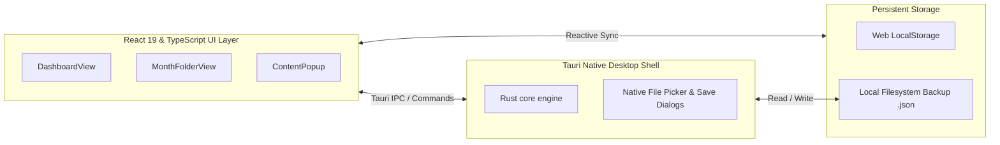
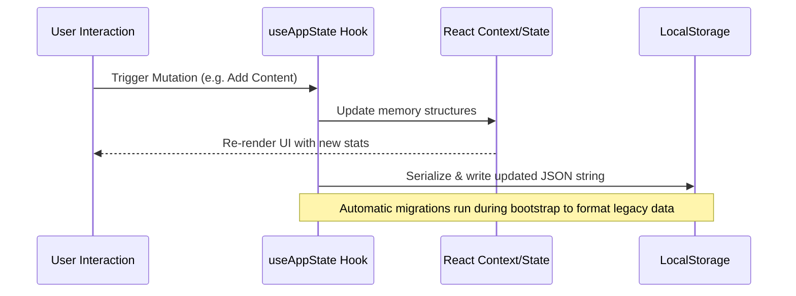

# Technical & Architecture Documentation: Asrep Tracker

This document provides a comprehensive technical overview, design specification, data schema guide, state lifecycle flow, and performance blueprint for **Asrep** (Analytics Report Tracker).

---

## 1. Executive Summary & Architecture

**Asrep** is a cross-platform desktop application designed to track, manage, and analyze daily social media content metrics across both **Instagram** and **TikTok** simultaneously. 

### Architecture Topology
The application is built on a modern **hybrid desktop architecture** separating native OS shell operations from the interactive analytics layer:



*   **Native Core (Rust + Tauri)**: Serves as the desktop container shell. It handles OS-level features such as opening file dialogue boxes for backup generation and file loading with maximum memory efficiency and a minimal binary footprint.
*   **Web Sandbox (React 19 + TypeScript + Vite)**: Handles the user interface, rendering of statistical metrics, chart visualization, and modal form transitions.
*   **Storage (LocalStorage & JSON Files)**: Supports an offline-first workflow. All data is saved inside the user's LocalStorage and can be exported to or imported from human-readable JSON files.

---

## 2. Directory Structure & File Index

The workspace is organized into a frontend React workspace and a backend Rust crate managed by Tauri:

```text
Asrep/
├── PROJECT_DOCUMENTATION.md      # Project documentation (Indonesian)
├── PROJECT_DOCUMENTATION_EN.md   # Project documentation (English - This File)
├── UIUX_DOCUMENTATION.md         # UI/UX design tokens, layouts, & guidelines
├── DESIGN.md                     # Design specification & metadata
├── README.md                     # Quickstart guide & environment setup
├── package.json                  # NPM scripts & package dependencies
├── vite.config.ts                # Vite config specifying Tauri-supported dev settings
├── tsconfig.json                 # TypeScript compiler configuration
├── src/                          # Frontend Source Directory
│   ├── App.tsx                   # Main Entry component, view router, & global dialog wrappers
│   ├── index.css                 # Global styles, Material Design 3 theme tokens, & custom keyframes
│   ├── types.ts                  # TypeScript interfaces for data models
│   ├── main.tsx                  # React bootstrap entry point
│   ├── components/               # UI Component Directory
│   │   ├── MacSidebar.tsx        # Navigation rail, platform profile updates, & JSON backup handlers
│   │   ├── DashboardView.tsx     # Performance dashboard (Summary cards, Recharts, Calendar widget)
│   │   ├── MonthFolderView.tsx   # Spreadsheet grid for entries, segmented filters, & search query engine
│   │   ├── ContentPopup.tsx      # Add/edit popup containing mirror features & form inputs
│   │   └── MacDropdown.tsx       # Custom drop-down overlay resolving click-block issues on Safari/WebKit
│   ├── hooks/
│   │   └── useAppState.ts        # Custom React state manager (CRUD, migrations, and exports)
│   └── utils/
│       └── initialState.ts       # Mock data seeding & helper calendar generators
└── src-tauri/                    # Native Rust Directory
    ├── Cargo.toml                # Rust dependencies & package configuration
    ├── tauri.conf.json           # Tauri permissions, build window shapes, & bundler parameters
    └── src/
        └── main.rs               # Entry point of native Rust shell & custom file IO commands
```

---

## 3. Core Data Schema (`types.ts`)

Type safety is enforced across the application using structured TypeScript interfaces:

### `ContentMetrics`
Aggregates key numerical metrics for a specific social media post:
```typescript
export interface ContentMetrics {
  views: number;     // Number of video impressions
  likes: number;     // Total likes
  comments: number;  // User comments count
  saves: number;     // Post bookmark/save count
  shares: number;    // Shares or repost count
}
```

### `ContentEntry`
Represents a single daily post containing parallel performance stats for Instagram and TikTok:
```typescript
export interface ContentEntry {
  id: string;                // Timestamp-based unique identifier
  day: number;               // Calendar date of creation (1 to 31)
  title: string;             // Topic or heading of the content
  instagram: ContentMetrics; // Instagram performance profile
  tiktok: ContentMetrics;    // TikTok performance profile
}
```

### `PlatformProfile`
Defines target account credentials and follower metadata:
```typescript
export interface PlatformProfile {
  username: string;
  fullName: string;
  followers: number;
}
```

### `FolderDataState`
A tree structure storing monthly entries nested under their respective year folders:
```typescript
export type FolderDataState = Record<number, Record<number, ContentEntry[]>>;
```

---

## 4. State Management & Data Flow

Global state is orchestrated via the `useAppState` hook, which centralizes CRUD actions and local storage syncing:



### Data Migration Engine
To ensure backward compatibility when schemas evolve, `useAppState` runs an automatic migration routine upon initialization:
- **Folders Migration (`migrateFoldersData`)**: Scans for older, single-platform or flattened properties and shifts them into the modern dual-platform structure (`instagram` / `tiktok`) without losing existing views or interaction counts.
- **Profiles Migration (`migrateProfilesData`)**: Upgrades obsolete user profiles to support the multiple accounts schema.

---

## 5. 60 FPS Performance & Motion System

The application is tuned to maintain a solid **60 FPS** rendering standard (or up to **120 FPS** on ProMotion/High-Refresh screens) using hardware-accelerated animations and React render tree optimizations:

### GPU-Accelerated Dialog Animations
The animations for **ContentPopup** (Add Content & Edit Content) utilize CSS Keyframes tied to properties processed exclusively by the GPU compositor:
- **Enter transitions**: Scale up from `0.92` to `1` combined with a smooth fade-in using a decelerated easing curve (`cubic-bezier(0, 0, 0, 1)`).
- **Exit transitions**: Scale down from `1` to `0.95` with a quick fade-out using an accelerated curve (`cubic-bezier(0.3, 0, 1, 1)`).
- **Layer Optimization**: The dialog container includes `will-change: transform, opacity` to force the browser to promote the popup to its own GPU layer, bypassing paint/reflow overhead.

```css
@keyframes md-dialog-enter {
  0%   { opacity: 0; transform: scale(0.92); }
  100% { opacity: 1; transform: scale(1); }
}
@keyframes md-dialog-exit {
  0%   { opacity: 1; transform: scale(1); }
  100% { opacity: 0; transform: scale(0.95); }
}
```

### Computation Memoization (Pruning CPU Cycles)
In `DashboardView.tsx`, heavy data aggregations (calculating growths, totals, and chart arrays) have been wrapped in `React.useMemo` to prevent recalculations on every frame (e.g., during input typing, dropdown changes, or sidebar toggles):
- **Yearly/Quarterly/Monthly Statistics**: Aggregates are computed only when the underlying database folders (`folders`), the selected platform (`activeView`), or calendar pointers change.
- **Weekly Cycles & Daily Trends**: Charts map data arrays dynamically inside `useMemo` blocks to keep mouse hover interactions and tooltips lag-free.
- **Callback Stability**: The `getMetrics` resolution utility is wrapped in `React.useCallback` to ensure memoized functions have a stable reference.

### Render Tree Optimization
Both [MacSidebar.tsx](file:///Users/Bonnxxv/Documents/Projek%20App%20Bonnxxv/Asrep/src/components/MacSidebar.tsx) and [MonthFolderView.tsx](file:///Users/Bonnxxv/Documents/Projek%20App%20Bonnxxv/Asrep/src/components/MonthFolderView.tsx) are wrapped in `React.memo()`. This tells React to skip diffing their DOM branches unless their specific inputs change, preventing useless render cascades.

---

## 6. Backup & Restore Specification (JSON)

Database portability is achieved using structured JSON backups.

### JSON Backup Schema
```json
{
  "version": "1.0",
  "timestamp": "2026-06-04T13:48:47.000Z",
  "years": [2025, 2026],
  "profiles": {
    "instagram": {
      "username": "example.ig",
      "fullName": "Instagram Profile",
      "followers": 10500
    },
    "tiktok": {
      "username": "example.tt",
      "fullName": "TikTok Profile",
      "followers": 45000
    }
  },
  "folders": {
    "2026": {
      "4": [
        {
          "id": "content-1717524600000",
          "day": 4,
          "title": "New Tech Review Video",
          "instagram": { "views": 18200, "likes": 1200, "comments": 45, "saves": 180, "shares": 35 },
          "tiktok": { "views": 32000, "likes": 2900, "comments": 150, "saves": 420, "shares": 95 }
        }
      ]
    }
  }
}
```

### Import Pipeline & Sanitization
When a user uploads a backup file:
1.  **Read & Parse**: The data is loaded asynchronously via the browser's `FileReader` API.
2.  **Schema Check**: Verification checks are performed to validate the presence of root keys (`profiles`, `folders`, `years`).
3.  **Sanitization**: Numeric values are filtered to prevent `NaN` states, and empty metrics are defaulted to zero.
4.  **Save & Refresh**: The React states are updated, instantly triggering a LocalStorage write and redrawing the dashboard views.

---

## 7. Development & Deployment Guide

### Native Dependencies
Building Asrep as a native desktop application requires:
*   [Node.js](https://nodejs.org/) (v18.0 or newer)
*   [Rust & Cargo Package Manager](https://www.rust-lang.org/) (installed via `rustup`)

### Local Setup
1.  Install dependencies:
    ```bash
    npm install
    ```
2.  Start the development environment (opens the Tauri webview wrapper automatically with hot-reload enabled):
    ```bash
    npm run dev
    # or
    npx tauri dev
    ```

### Packaging & Distribution (Build)
To compile the native app wrappers (creates `.app`/`.dmg` on macOS, `.exe` on Windows, and `.deb` on Linux):
```bash
npm run build
# or
npx tauri build
```
The compiled installers will be written directly to `src-tauri/target/release/bundle/`.
